# 
# WDI GROUP PROJECT: ExploreMore App

## Brief
We were set a challenge to design and collaboratively build a MEAN stack app.

Technical requirements:

- Use of an external Web API
- Wireframes
- Model Schemas
- Team contributions managed using a Git on Github
- Deployed application online
- Minimum of two related models with all RESTful actions for at least one model
- Include tests

## Technologies Used / Stack

### Server-side

- MongoDB
- Mongoose
- Node.js
- Express.js
- JavaScript
- Gulp.js

### Client-side

- AngularJS
- JavaScript
- HTML
- CSS
- SCSS
- Bower
- Babel
- Bulma framework

### Other

- Mocha
- Chai
- GitHub
- Heroku

## Local Set-up of Dependencies

Clone or download the repository and navigate to it's root in the terminal.

- run `yarn` / `npm i`
- run `mongod`
- run `gulp`
- run `node db/seeds`
- Navigate to `http://localhost:7000`

## Overview

Initially, several themes were considered during a quick brainstorming session, mainly associated with using one of NASA's APIs. However, further discussions on how to create a functional purposeful app, a decision was made to focus on a location searchable music event app with group interaction.  The user experience design intention was to create a group interaction for people going to the same music events.

During planning stage of the project, we wireframed and planned as a group on a whiteboard before transferring the agreed content including assigned tasks into Trello and Adobe Illustrator / Adobe XD.

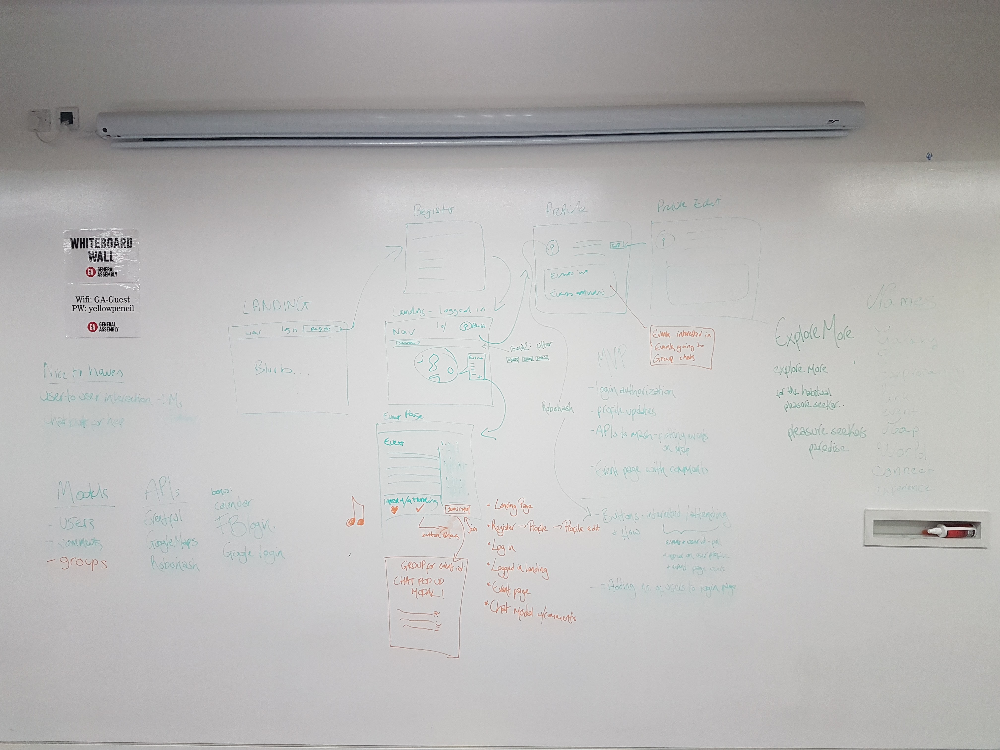

Image 1: Wireframing

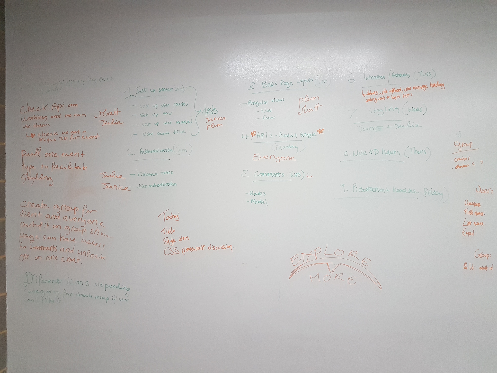

Image 2: Task Breakdown

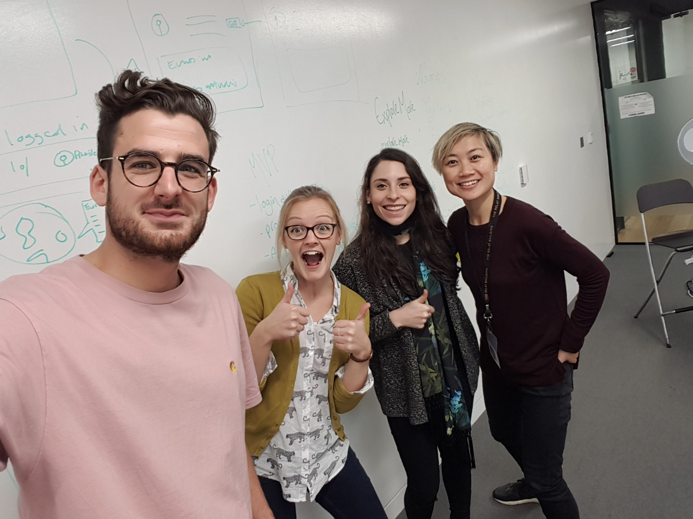

Image 3: Team Planning

Planning together on a whiteboard was crucial to visualise the mechanics of the app whilst also breaking down the app into workable tasks to be divided amongst the group. We individually selected tasks which we may not have had time previously to focus on, in order to maximise learning opportunity. The project was completed with a mix of individual and pair-programming.

Image 4: Adobe Illustrator Wireframe design

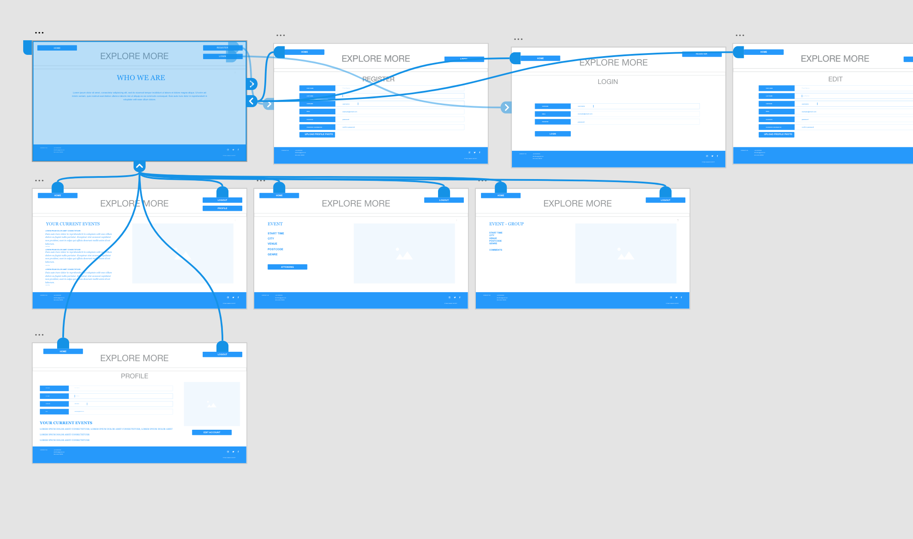

Image 5: Adobe XD Wireframe

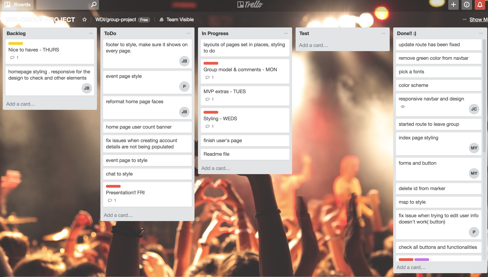

Image 6: Snapshot of Working Trello Board

The planning work completed was then transferred to usable packages for reference throughout remainder of project. Trello was used to review and divide remaining tasks whilst various Adobe packages to keep visual of initial design and layout.

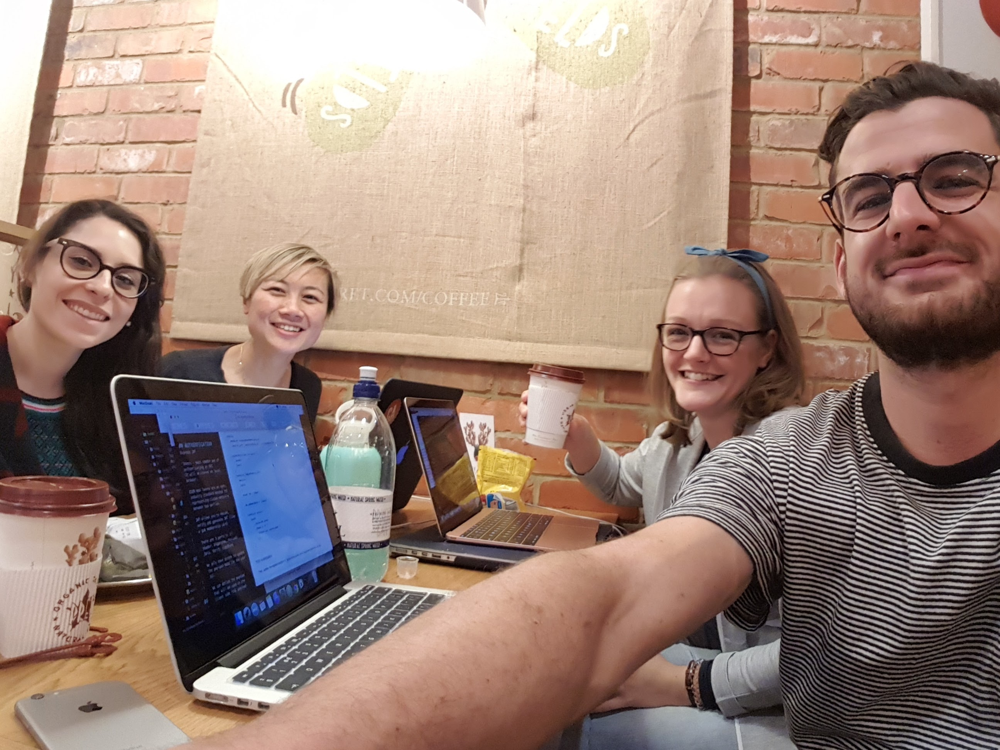

Image 7: Teamworking

## Mechanics

### Landing Page of the Website

The landing page of the website needed to be visually appealing in order to market the Explore More App. Minimal colour palette on the main components and elements were chosen. The animated coloured wave was styled to mimic musical wave and flow in-keeping with the focus on musical events. The users' photos appearing on this landing page was to portray a sense of group-use, this would also serve as general promotion of the website.

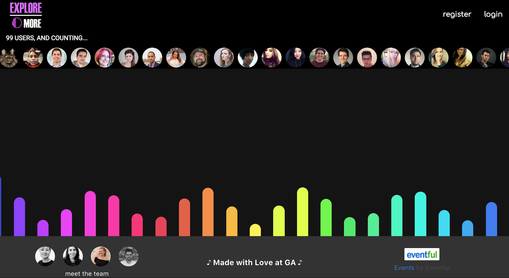

Image 8: Landing Page of Website Application

### Register / Login

In order to encourage group interaction, users must be registered and logged into the site to access it's full functionality. These a presented in standard form format pages where the information can be typed in and submitted.

### Searchable Music Events based on location

From a user experience perspective, people are familiar with Google Maps, therefore we used the Google map API as a large feature on the event search page. Users are able to type in a location and find music events within a 3 mile radius of selected location. A dark styling of the map was selected to represent evening music events, adding to the social/group interaction experience.

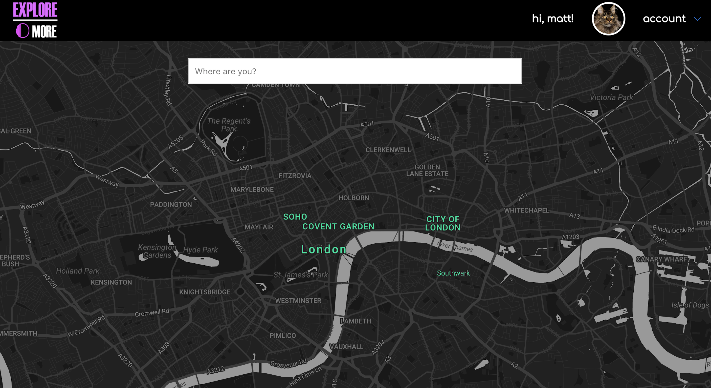

Image 9: Location Google Search Map

### Event Selection

When a search is completed, a number of musical events in the immediate vicinity is populated onto the map. This is completed through an ajax request to the Eventful API, specifically for music events. Eventful API was selected for scalability to include other non-music events globally. Upon clicking an event marker, the user is navigated to the event page containing the details of the event with a map and photo of the location. At this point, the user can decide to create a group chat for the specific event.

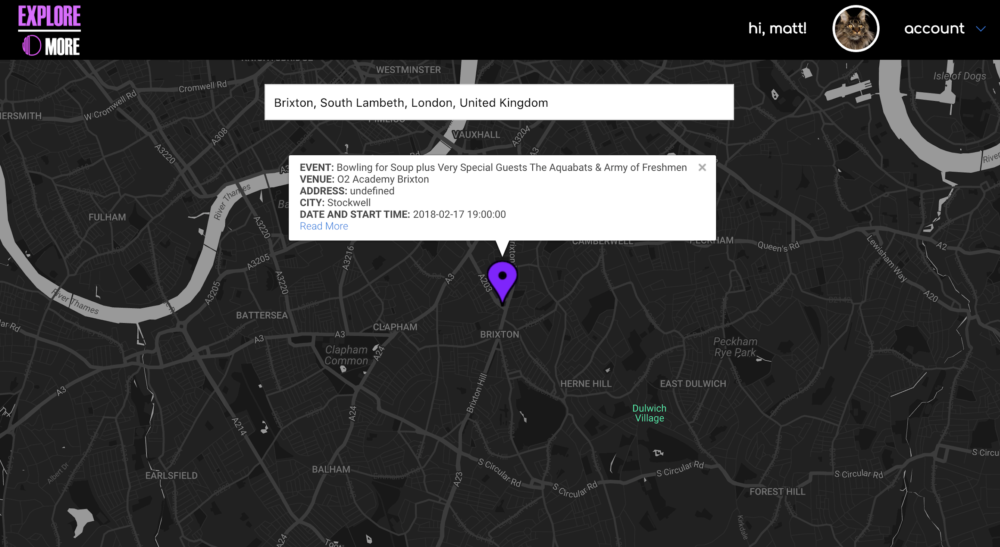

Image 10: Details of Event at Location

The user can click on read more in order to redirect to an events page.

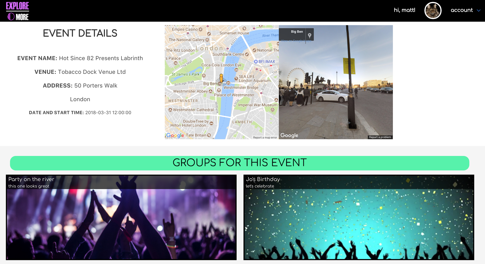

Image 11: Event Details Page

### Creating Groups

Once a user decides they would like to attend the event or generally create a group possibly amongst friends/other users to discuss potentially going to a music event, they can create a group chat. The user has the ability to name the group, url to a photo and a description of the purpose of the group. Once created, this group chat is saved in the user's profile and is also visible to other users who click on the same music event.  This gives other users the ability to join the group and comment.

Image 12: Event Chat Page

### Group Chat Page

Users who create and join specific group for an event can then interact through comments feature. The comments are created via an embedded reference so that the user and time stamp of comment left is visible on the Group chat page.

The users always have the freedom to leave a group chat and the creator of the group has the ability to edit the initial details of the group.

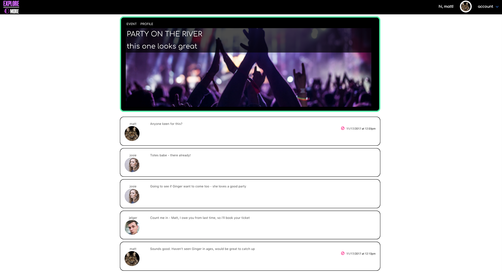

Image 13: Group Chat Page

### User Profile

The profile page gives the user a central page overview with their details and which music events and chat groups they have either created or joined. This allows easy navigation upon logging into the app. In addition, the user has the ability to update and edit their own details in the app.

## Challenges

During the planning stages, Bulma was selected as a framework to be used on the frontend styling due to it's lightweight nature in order for customisation. None of the group had used it so this was taken as an opportunity to expand into using other CSS frameworks.  Although, Bulma allowed minimal styling and followed a column-container system similar to the heavier, Bootstrap, the team found it a challenge to customise the Bulma framework components and elements. The full app was created to a minimal standard of styling for minimum viable product (MVP), however, it took more time than initially planned and therefore not all styling was completed.

We found that sometimes it's more challenging to split up code or pair programme for certain functions. Also given the time constraints, we naturally divided to complete certain code which was more urgent in order to meet our MVP.

Initially, we set out looking at creating an application to look at all types of events. We scaled this back to focus on music which allowed us to theme our styling. The Eventful API was selected for this reason as it had multiple fields that we could potentially pull from, however, as we discovered as we progressed, some image fields seemed to be missing from their data.  We overcame some of these issues by pulling from Google street map.

## Wins

Build of backend server, this was straight forward as at this point we all had built a few applications which meant the start was fast track.

We worked well as a team and learned whilst pair programming and how different features interlink and implementing in practise.

Meeting minimum viable product and understanding when to let go of extra features due to time constraints.

As challenging as Bulma can be to customise, it is always good to learn a new framework and challenge ourselves as a team.

## Additional Features to Implement

- Fully responsive

- Uploading user photo:

- Using alternative / additional APIs

- Additional events other than music

- OAuth

- Links to other social media sites
