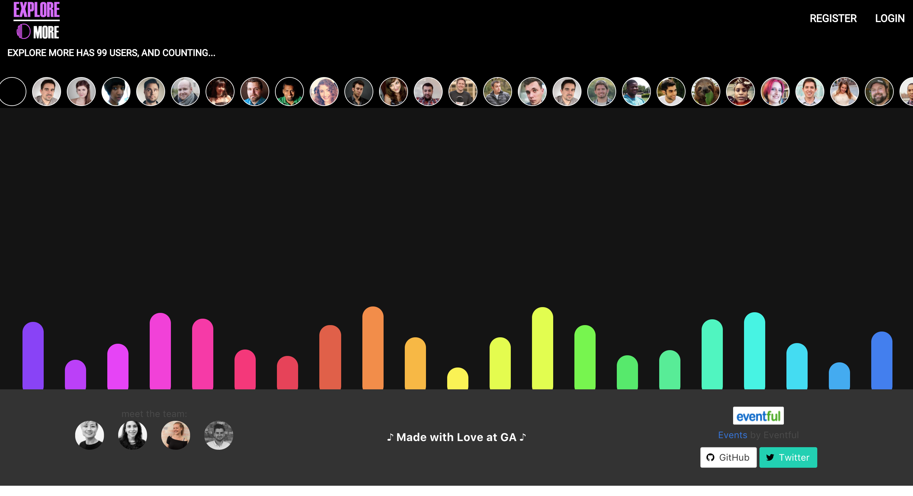

#  
# WDI GROUP PROJECT: ExploreMore App

## Brief
We were set a challenge to design and collaboratively build a MEAN stack app. 

Technical requirements:

- Use of an external Web API
- Wireframes
- Model Schemas
- Team contributions managed using a Git on Github
- Deployed application online
- Minimum of two related models with all RESTful actions for at least one model
- Include tests

## Technologies Used / Stack

### Server-side

- MongoDB
- Mongoose
- Node.js
- Express.js
- JavaScript
- Gulp.js

### Client-side

- AngularJS
- JavaScript
- HTML
- CSS
- SCSS
- Bower
- Babel
- Bulma framework

### Other

- Mocha
- Chai
- GitHub
- Heroku

## Local Set-up of Dependencies

Clone or download the repository and navigate to it's root in the terminal.

- run `yarn` / `npm i`
- run `mongod`
- run `gulp`
- run `node db/seeds`
- Navigate to `http://localhost:7000`

## Overview

Several ideas were initially considered, mainly associated with using one of NASA's APIs. However, further discussions on how to create a functional purposeful app, a decision was made to focus on a location searchable music event app with group interaction.  The user experience design intention was to create a group interaction for people going to the same music events.

During planning stage of the project, we wireframed and planned as a group on a whiteboard before transferring the agreed content including assigned tasks into Trello and Adobe Illustrator / Adobe XD.

Image 1: Wireframing

Image 2: Task Breakdown

Image 3: Team Planning

Planning together on a whiteboard was crucial to visualise the mechanics of the app whilst also breakdown the app into workable tasks to be divided amongst the group. We individually selected tasks which we may not have had time previously to focus on, in order to maximise learning opportunity. The project was completed with a mix of individual and pair-programming. 

# ADD SNAPSHOT OF ILLUSTRATOR image 4

Image 5: Adobe XD Wireframe

Image 6: Snapshot of Working Trello Board

The planning work completed was then transferred to usable packages for reference throughout remainder of project. Trello was used to review and divide remaining tasks whilst various Adobe packages to keep visual of initial design and layout.

Image 7: Teamworking

## Mechanics

### Landing Page of the Website

The landing page of the website needed to be visually appealing in order to market the Explore More App. Minimal colour palette on the main components and elements were chosen. The animated coloured wave was styled to mimic musical wave and flow in-keeping with the focus on musical events. The users' photos appearing on this landing page was to portray a sense of group-use, this would also serve as general promotion of the website.

### Searchable Music Events based on location

In order to populate 

## Challenges

Bulma
Bulma
Bulma

## Wins

meeting MVP

## Additional Features to Implement

Using alternative / additional APIs

Additional events other than music

uploading user photo

OAuth

Links to other social media sites
